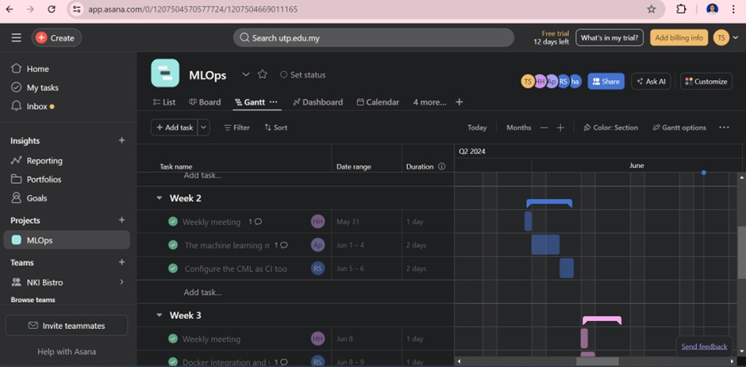
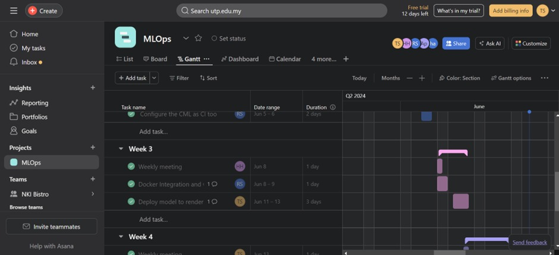

# NKIBistro Group Project

| Nama | NRP | 
|---------|---------|
| Rio Rezky Seleng | 5026211191  | 
| Harist Hamzah Hutapea | 5026201194  |
| Tabassum Kajlima Syafrin | 5026211193  | 
| Aria Radzika Pradayan | 5026211054 |

This report summarizes the progress made on the final project for Operation Systems and Development during Week 1 until Week 4.

**[Week 1 Progress]**
  1. Define Project Scopes and Objectives (MLOps)\
     The scope of an MLOps application for diabetes prediction, it means that the goal is to manage the life cycle of the machine learning model, so that the solution properly works in production. While, the primary objective of this MLops application is to build a robust and reliable pipeline for developing and deploying a machine learning model for diabetes prediction. Furthermore, the application should be designed to handle increasing data volumes and facilitate future enhancements or modifications to the model.
  2. Project Timeline and Weekly Meeting\
     To ensure that our MLOps project runs according to plan, we are using Asana to make the project's gantt chart to track progress and execution (Gantt chart) and key milestones.\
     [Asana](https://app.asana.com/0/1207504570577724/1207504570577724)\
     \
  4. Github repository already created
  5. Begin creating CI tools using GitHub Action\
     We use GitHub Actions to automate our Continuous Integration (CI) process because it integrates directly with our GitHub repositories, triggering workflows on code commits and pull requests to ensure that our code always meets quality standards. It allows us to automatically run tests and build processes, reducing errors and improving productivity by providing immediate feedback on integration issues. Additionally, GitHub Actions supports a variety of operating systems and programming languages, making it a versatile tool for diverse development environments.

**[Week 2 Progress]**
  1. Project Timeline and Weekly Meeting\
     This Gantt chart, along with the additional information, assists the team in following a structured and organized method for the project, making sure all tasks are monitored, deadlines are achieved, and team members are in sync with the project objectives. Utilizing Asana increases effectiveness in managing projects and offers a central hub for teamwork and monitoring progress.\
     
  3. The machine learning model created\
     The script is made for a task involving the categorization of logistic regression. Data pretreatment steps include partitioning the dataset and removing unnecessary attributes. The test dataset's ability to predict diabetes accurately is used to evaluate the model's performance.
  4. Configure the CML as CI tools into github action\
     The final-project-pso GitHub Actions workflow is created to automatically train a machine learning model whenever new code is added to the repository. The setup is designed to operate on an Ubuntu system and utilizes Docker to install the required utilities. 

**[Week 3 Progress]**
  1. Project Timeline and Weekly Meeting\
     
  3. Docker Integration and Configuration\
     The container we are using for MLOps is Docker. Docker is chosen in MLOps for its ability to ensure consistency across environments from development to production, eliminating the "it works on my machine" problem by packaging applications with their dependencies. Its use of containers facilitates the automation of the machine learning lifecycle, making it easier to deploy, scale, and manage applications swiftly and securely. Docker also supports reproducibility and version control, critical for managing machine learning experiments and promoting collaboration among teams. The picture below us is the creation of the docker image:\
     The next image is running the docker image:\
     The last image shows the PyCharm IDE with a project named NKBistro2. It includes a Dockerfile that specifies the configuration for the Docker container. The Dockerfile details are as follows:\
  4. Deploy model to render.com using scripts\
     We use Render.com for deploying our model because it simplifies the hosting and scaling of web applications, and it integrates seamlessly with GitHub for continuous deployment. We use a Streamlit script because it allows for rapid development of interactive web interfaces for our models, making it easier to showcase and test model functionalities directly through a web browser.

**[Week 4 Progress]**
  1. Project Timeline and Weekly Meeting
  2. Integrate monitoring tools to create the capability for continuous tracking of application/model performance and health\
  3. Develop detailed documentation that comprehensively covers all aspects of the project\
     [Docs](https://docs.google.com/document/d/1vb36yzeDh1IrqMiPxY2mSB78LWPjOWxEdTaOaMFIhNY/edit?usp=sharing)
     [Asana](https://app.asana.com/0/1207504570577724/1207504570577724)

This project is done as a requirement to complete **Operational System Course** at Information Systems Department Sepuluh Nopember Institute of Technology
